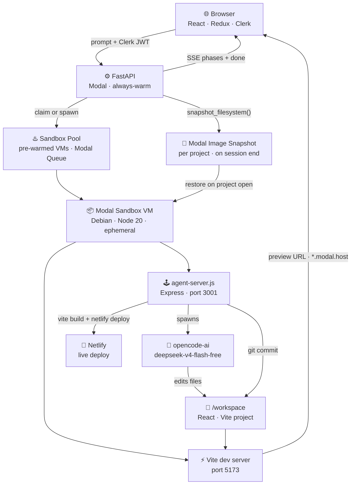

# Buildman

Yet another AI app builder.

Describe what you want. Watch it get built live in a real cloud VM. Deploy to Netlify in one click.

---

## Features

- **Live preview** — every prompt streams changes into an iframe in real time
- **Chat-based iteration** — refine your app conversationally across multiple prompts
- **Git checkpoints** — every prompt produces a commit; jump back to any version
- **One-click deploy** — ships directly to a dedicated Netlify site per project
- **Persistent workspaces** — projects survive sandbox restarts via Modal filesystem snapshots
- **Sandbox prewarm** — a VM is provisioned in the background on sign-in so your first build starts fast
- **Starter template** — every project begins from a production-ready React + Vite + Tailwind base

---

## Architecture



**Browser** — React frontend with Clerk auth. Streams SSE from FastAPI. Renders the live preview in an iframe via a Modal encrypted tunnel URL.

**FastAPI (Modal)** — Always-warm Python backend. Manages sessions, project metadata, and sandbox lifecycle. Proxies all prompt traffic to the sandbox.

**Sandbox Pool** — A Modal Queue holds 2 pre-warmed VMs. New projects claim from the pool instantly; a background scheduled function tops it back up every 5 minutes.

**Modal Sandbox VM** — One ephemeral VM per user. Spun up from a baked Debian image with Node 20, opencode-ai, and Netlify CLI pre-installed. Idle timeout: 15 min.

**agent-server.js** — Express control plane inside the sandbox (port 3001). Receives prompts, drives opencode-ai, commits checkpoints, and handles deploy/restore.

**opencode-ai** — Runs `deepseek-v4-flash-free` (free, no API key required). Edits files inside `/workspace` in response to each prompt.

**Modal Image Snapshot** — After each session (`save_chat`), the FastAPI backend calls `sandbox.snapshot_filesystem()` to capture the full VM state. On project reopen, it restores from that snapshot so work is never lost.

---

## Stack

| Layer | Tech |
|---|---|
| Frontend | React 19, Redux Toolkit, Tailwind CSS v4, Clerk |
| Backend | FastAPI, Python 3.12, Modal |
| Sandbox | Debian slim, Node 20, opencode-ai, Netlify CLI |
| Starter template | React + Vite + Tailwind + React Router + TanStack Query |
| Auth | Clerk (JWT validated server-side via JWKS) |
| Persistence | Modal image snapshots (`snapshot_filesystem`) |
| Deploy target | Netlify (one site per project) |

---

## Self-hosting

### Prerequisites

- [Modal](https://modal.com) account — `pip install modal && modal token new`
- [Clerk](https://clerk.com) account — for user auth
- [Netlify](https://netlify.com) account — for project deploys
- Node.js 18+ and Python 3.12+

### 1. Clone and install

```bash
git clone https://github.com/khalatevarun/buildman
cd buildman

# Backend
python3 -m venv .venv
source .venv/bin/activate
pip install -r backend/requirements.txt

# Frontend
cd frontend && npm install && cd ..
```

### 2. Configure Modal secrets

```bash
# Clerk — get JWKS URL from: Clerk dashboard → API Keys → Advanced → JWKS URL
modal secret create clerk-credentials CLERK_JWKS_URL=https://<your-clerk-domain>/.well-known/jwks.json

# Netlify — get token from: Netlify → User Settings → OAuth → Personal access tokens
modal secret create netlify-credentials NETLIFY_AUTH_TOKEN=<your-token>
```

### 3. Configure frontend

```bash
cp frontend/.env.example frontend/.env
```

Fill in `frontend/.env`:

```env
VITE_CLERK_PUBLISHABLE_KEY=pk_...              # Clerk dashboard → API Keys
VITE_API_URL=https://your-app.modal.run        # from modal deploy output (step 4)
```

### 4. Deploy to Modal

```bash
source .venv/bin/activate
modal deploy backend/modal_app.py
```

Copy the printed URL into `VITE_API_URL` in `frontend/.env`.

### 5. Run the frontend

```bash
cd frontend
npm run dev       # dev at http://localhost:5173
npm run build     # production build
```

---

## Project structure

```
buildman/
├── frontend/               # React app
│   └── src/
│       ├── pages/          # Home, Projects, Workspace
│       ├── components/     # ChatPanel, PreviewPane, CheckpointCard, ...
│       ├── hooks/          # useSandbox, usePrompt, useProjects
│       └── store/          # Redux slices
└── backend/
    ├── api/
    │   └── main.py         # FastAPI — all endpoints
    ├── sandbox_image/
    │   ├── agent-server.js # Control plane inside each VM
    │   ├── package.json
    │   └── starter/        # Starter template baked into sandbox image
    ├── modal_app.py        # Modal app — images, sandbox pool, scheduled functions
    ├── sandbox_embedded.py # Auto-generated — do not edit
    └── tests/
        └── test_backend_flow.py
```

---

## License

MIT
